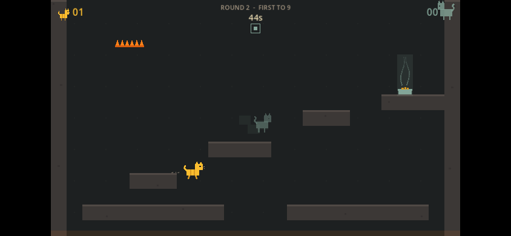

# copycats

[](https://github.com/ampactor-labs/copycats/actions/workflows/ci.yml) [](https://github.com/ampactor-labs/copycats/actions/workflows/determinism.yml)

A browser platformer where you play a cat racing replays of your own earlier runs to the dinner bowl, built with Godot 4.7 and GDScript. Between runs you knock one object into the house, and it can swat any replay recorded before it landed. The simulation uses integer math only, so a run is stored as its input log and replays identically on every platform CI checks. It also has a daily house shared by date and a couch mode for 2 to 8 players on one screen.

**Status: shipping.** Everything runs on one device: the async group-chat multiplayer that [DESIGN.md](DESIGN.md) describes is designed but not built.

Live: https://ampactor.dev/copycats/



## Quick start

To play, open https://ampactor.dev/copycats/ in a desktop browser or on a phone held in landscape. There is nothing to install.

To run it from source you need [Godot 4.7](https://godotengine.org/download/archive/4.7-stable/). In the commands below, `godot` stands for your Godot 4.7 binary. From the repository root:

```sh
godot --path game
```

The window opens on the title screen. Press Enter or click SOLO to start a match.

### Controls

| Action               | Phone                                                         | Keyboard                   |
| -------------------- | ------------------------------------------------------------- | -------------------------- |
| Move                 | Slide a thumb on the left of the screen (a floating stick)    | A and D, or Left and Right |
| Jump                 | Tap the right of the screen; hold for a higher jump           | Space, W or Up             |
| Drop through a shelf | Swipe down on the right of the screen                         | S or Down                  |
| Place an object      | Drag a card into the house, then confirm, rotate or cancel it | The same, with the mouse   |

You can also slide down walls and jump off them. Enter starts a match from the title and game-over screens, and F1 toggles a debug overlay.

## Usage

### Modes

- **Solo** starts in an empty house. Every run that reaches the bowl becomes a copycat (a replay of that run) that races you in later rounds, and the three most recent stay. From round 2 you pick one of three offered objects before each run and place it: a shelf (a one-way plank), a cushion (a spring), a cactus, a box fan or a ball launcher. At least one of the three is a hazard. Each run has 45 seconds.
- **Daily** is solo on a house generated from the UTC date, so everyone gets the same house on the same day. The title screen shows your best result for the day (the fewest rounds to win), stored on the device.
- **Couch** is 2 to 8 cats sharing one screen. Each round every player places one object, then each player runs the same locked house in turn against the pool of earlier runs. The round then replays every run at once and names each swat by the cats' pelts ("SOOT SWATS PEARL"). The match autosaves after every round, and the Couch screen offers to resume it.

### Scoring

The first side to 9 points wins. In solo you play against your copycats:

- If you reach the bowl, you score 1 plus 1 for each copycat you swatted. If you swatted none and they all made it too, the round was too easy and nobody scores.
- If you die, the copycats score 1 for each of them that survived.

In couch, each finisher scores 1 and the earliest finisher 1 more, but if every cat finishes those points are cancelled. Every swat, of a live cat or a copycat, scores 1 for whoever placed the object, including swats of your own copycats.

## How it works

The game is the Godot project in `game/`, which uses the GL Compatibility renderer. It has two parts.

- `game/sim/` is the simulation, and it has no floating-point math. Positions are integers in units of 1/65536 of a tile (Q16.16 fixed point, which does fractional math with integers). The clock is a fixed 60 ticks per second, the random number generator is its own xorshift, and nothing uses Godot's physics engine. The sim has no node dependencies and runs headless.
- `game/render/main.gd` is the shell: scene flow, touch and keyboard input, effects and drawing. It reads sim state and feeds the sim one input byte per tick, and it never writes sim state otherwise.

I chose a deterministic integer sim so that a run is a small file. Online play then needs only record and replay, with no rollback netcode, and any client can re-simulate a submitted run to check it. [DESIGN.md](DESIGN.md) has the full design and the build order.

### Replays and copycats

A run is its input log: one byte per tick holding the stick axis and the jump and down buttons. `game/sim/s_replay.gd` stores it behind a 12-byte header (the bytes `CHKR`, then sim version, round and length), so a full 45-second run is 2,712 bytes. A replay loads only when its version equals `SIM_VERSION`, and there are no migrations.

A copycat is a recorded input log re-simulated against the house as it stood when the run was recorded. When a race starts, `SimRace` also computes each copycat's fate: the first tick at which an object placed after that run overlaps it. So an object can swat only runs older than itself, and every copycat's fate is fixed before anyone moves.

### Daily houses

`SimGen` builds a rising staircase of three platforms from the ground to the bowl, with every step sized inside the jump. A full jump peaks at 3.3 tiles, so climbs are at most 2 tiles, gaps between platforms at most 3 and pits at most 4. A chaos bot (it runs right and jumps in seeded random bursts) then has to reach the bowl within 100 bot seeds. If it fails, the generator tries another house seed, up to 30 times, and after that falls back to the fixed classic house.

### Couch matches

`SimVersus` keeps a match as an append-only log of placements and runs, and derives scores, copycat pools and standings by replaying that log. The autosave is the log as JSON in `user://couch.save`, and resuming replays it. DESIGN.md plans to use the same log as the wire format for online matches.

### Palette and the prototype

The palette is gruvbox. Only blue and orange carry meaning (you are the orange tabby, copycats are blue), and each hazard has its own shape, so that red-green color blindness (deuteranopia) hides nothing.

`index.html` at the root is the original single-file JavaScript prototype, built under the working name chickho. It is kept as the reference for how movement should feel and is separate from the game.

## Project layout

```
game/
  project.godot     Godot project: 832x480 canvas, landscape
  sim/              deterministic simulation, integer math only
  render/           main.gd (scenes, input, drawing) and audio.gd
  tests/            headless suites, fuzz soak, determinism dump
  tests/canonical/  the replay the determinism matrix re-simulates
  test.sh           the test gate CI runs
index.html          the original single-file browser prototype
DESIGN.md           the full design: async multiplayer, levels, build order
```

## Deploy

`.github/workflows/deploy.yml` publishes the web build to GitHub Pages on every push to `main` that changes a file other than Markdown, and on manual dispatch. It downloads Godot 4.7 and its export templates, exports the `Web` preset and checks that `index.html` and `index.wasm` exist. The preset is the single-threaded web build, which needs no cross-origin isolation headers (COOP and COEP), so GitHub Pages can serve it. https://ampactor-labs.github.io/copycats/ redirects to https://ampactor.dev/copycats/.

To export locally, install the Godot 4.7 export templates and run:

```sh
mkdir -p game/build/web
godot --headless --path game --export-release Web build/web/index.html
```

The export path is relative to `game/`, and `game/build/` is gitignored.

## Testing

```sh
GODOT=/path/to/Godot_v4.7-stable_linux.x86_64 bash game/test.sh
```

Without `GODOT`, the script uses `~/Godot/Godot_v4.7-stable_linux.x86_64`. It imports the project, then runs four headless suites and stops at the first failure. On a 4-core Linux container it took 45 seconds and passed 73 checks plus the fuzz soak.

| Suite                          | Checks      | What it covers                                                                                                                                                                   |
| ------------------------------ | ----------- | -------------------------------------------------------------------------------------------------------------------------------------------------------------------------------- |
| `game/tests/run_tests.gd`      | 50          | Jump height, run speed, coyote time and jump buffering, placement rules, scoring, the replay codec, daily house generation, couch scoring and resume, and three determinism gates |
| `game/tests/run_flow.gd`       | 13          | Two solo rounds played through the real scene with synthetic touch events                                                                                                        |
| `game/tests/run_couch_flow.gd` | 10          | A three-cat couch round played through the real scene, from the setup screen to round 2                                                                                          |
| `game/tests/fuzz.gd`           | 2 per match | Random matches: 10 by default, `FUZZ=50` in CI                                                                                                                                   |

Coyote time lets a jump fire for 0.1 seconds after you walk off a ledge, and jump buffering remembers a jump pressed up to 0.12 seconds before landing and fires it on landing. The three determinism gates check that the same input log run twice gives an identical checksum trail, that a re-simulated replay matches the live run position for position, and that a golden replay checksum is unchanged. A real sim change fails that last gate, so it has to bump `SIM_VERSION` and re-mint the golden value.

The solo flow test taps through the title, moves with the touch stick and dies in the pit. It then injects a copycat: a bot run found by searching seeds for one that reaches the bowl, which also shows that chaotic play can beat the classic house. It places a fan on that run's path and checks that the copycat dies. The generation tests check 20 house seeds for pit width and room for traps, and check that 8 sample dates never fall back to the classic house. The fuzz soak places random valid objects, plays random inputs, and requires an identical checksum trail across two runs and a replay that re-simulates position for position.

In CI, `ci.yml` runs `test.sh` with `FUZZ=50` on Ubuntu for every push and pull request that changes a file other than Markdown. `determinism.yml` runs `tests/dump_checksums.gd` on Linux x64, Linux arm64, macOS arm64 and Windows x64. Each writes a per-tick checksum trail for a 900-tick physics run and for a race against the canonical replay `game/tests/canonical/run_v1.chkr`, and a final job requires the four files to match byte for byte. The local dump is 2,104 lines:

```sh
godot --headless --path game -s res://tests/dump_checksums.gd -- --out /tmp/checksums.tsv
```

After a `SIM_VERSION` bump, re-mint the canonical replay with `godot --headless --path game -s res://tests/gen_canonical.gd -- --write` and update `GOLDEN` in `game/tests/run_tests.gd`.

The suites do not test drawing, audio, keyboard input (the flow tests use touch events), the daily mode through the UI (its generator is tested directly) or the exported web build, which CI only checks exists.

## Limitations

Copycats runs on one device only. Matches and best scores are stored on that device, and racing a friend means passing them the screen. The async group-chat multiplayer and the daily leaderboard that DESIGN.md plans are not built, so there is no server and no way to share a replay.

- Replays expire with the sim. Any change to the simulation bumps `SIM_VERSION`, and replays and couch saves from older versions stop loading. There are no migrations, by choice, and an old couch save is deleted when you try to resume it.
- The game is landscape only. The 832 by 480 canvas keeps its aspect ratio, so in portrait it shrinks to a strip across the middle of the screen.
- The first load is heavy. The web build downloads a 39.5 MB WebAssembly engine (`index.wasm`), which GitHub Pages sends gzip-compressed as 10.2 MB (measured from a local export and the live file's headers).
- Determinism is checked on desktop builds only. GDScript gives no determinism guarantee: the integer-only rules and the CI matrix enforce it, and the matrix does not run the web build. This matters once replays travel between devices, which none do yet.

## Roadmap

Milestones M1 to M3.5 in DESIGN.md are done. The next two are:

1. Online matches (M4): a relay on Railway with room codes, invite links, async rounds, strangers' copycats in the daily and a leaderboard. No code for it exists yet, and it is the first milestone that needs a server.
2. Spectacle (M5): a shareable video of each resolved round, turn notifications, cosmetics and an installable web app. It builds on the online rounds from M4.

## License

No license chosen yet.
